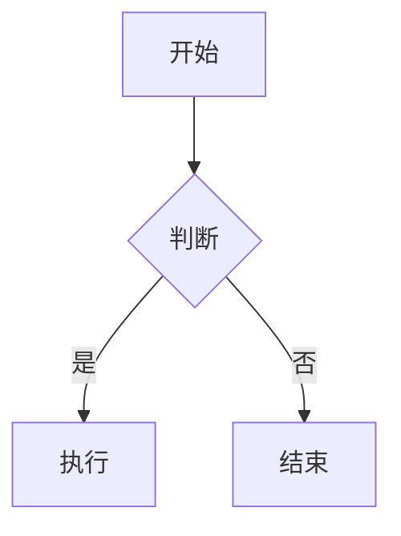
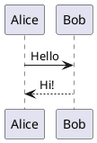

# Markpad 功能使用手册

本文档介绍 Markpad 的主要功能和使用方法。

## 1. 基础操作

### 1.1 打开文件

- **拖放**: 将 `.md` 文件直接拖放到应用窗口
- **快捷键**: `Ctrl+O` 打开文件选择对话框
- **命令行**: `markpad.exe document.md`
- **文件关联**: Windows 安装版双击 `.md` 文件自动打开

### 1.2 标签页管理

| 操作 | 快捷键 |
|:---|:---|
| 新建标签 | `Ctrl+T` |
| 关闭标签 | `Ctrl+W` |
| 撤销关闭 | `Ctrl+Shift+T` |
| 切换标签 | `Ctrl+Tab` / `Ctrl+数字` |
| 关闭其他标签 | 右键标签 → Close Other Tabs |
| 关闭右侧标签 | 右键标签 → Close Tabs to Right |

### 1.3 视图模式

- **查看模式**: 只读显示渲染后的 Markdown
- **编辑模式**: 使用 Monaco 编辑器编辑源码
- **分屏模式**: 左侧编辑，右侧实时预览

切换方式：
- 点击工具栏的 **Split** 按钮
- 快捷键 `Ctrl+E` 切换查看/编辑模式

## 2. Markdown 渲染特性

### 2.1 代码语法高亮

使用 `highlight.js` 提供语法高亮，支持 100+ 种语言。

代码块会自动显示语言标签：

````markdown
```rust
fn main() {
    println!("Hello, World!");
}
```
````

### 2.2 数学公式 (KaTeX)

支持行内公式和块级公式：

```markdown
行内公式：$E = mc^2$

块级公式：
$$
\int_{-\infty}^{\infty} e^{-x^2} dx = \sqrt{\pi}
$$
```

### 2.3 图表渲染 (Mermaid)

本地渲染 Mermaid 图表，支持流程图、时序图、甘特图等：

````markdown

````

### 2.4 图表渲染 (Kroki)

通过 Kroki 服务支持更多图表语言：

| 语言 | 说明 |
|:---|:---|
| `plantuml` | UML 图、时序图 |
| `graphviz` / `dot` | 结构化图形 |
| `excalidraw` | 手绘风格图表 |
| `ditaa` | ASCII 艺术转图片 |
| `bpmn` | 业务流程图 |

示例：

````markdown

````

**注意**: Kroki 需要联网访问 `kroki.io` 服务。

### 2.5 图表源码切换

将鼠标悬停在图表右上角，点击 `< >` 按钮可查看原始绘图代码。

### 2.6 GFM Alerts

支持 GitHub 风格的提示块：

```markdown
> [!NOTE]
> 这是一条备注

> [!WARNING]
> 这是一条警告
```

### 2.7 YouTube 嵌入

自动将 YouTube 链接转换为嵌入播放器：

```markdown
https://www.youtube.com/watch?v=dQw4w9WgXcQ
```

## 3. 工具栏功能

### 3.1 标准工具栏

| 按钮 | 功能 |
|:---|:---|
| 🔍 Zoom | 缩放视图 (`Ctrl+滚轮` 或 `Ctrl+/-`) |
| 📁 Open Location | 在文件管理器中显示文件 |
| ⬜ Split | 切换分屏模式 |
| 🔄 Sync | 启用滚动同步 |
| 👁 Live | 实时模式（监听文件变更） |
| 📋 Metadata | 显示 YAML Frontmatter |
| 📑 TOC | 显示目录侧边栏 |
| 🎨 Theme | 切换主题 |
| ✏️ Edit | 切换编辑模式 |

### 3.2 可定制工具栏

- **隐藏按钮**: 右键点击工具栏按钮 → Hide
- **恢复按钮**: 点击 `...` 菜单 → 右键点击隐藏项 → Show

## 4. 编辑器功能

### 4.1 Monaco 编辑器

基于 VS Code 的 Monaco 编辑器，支持：

- 语法高亮
- 自动补全
- 多光标编辑
- 查找替换 (`Ctrl+F`, `Ctrl+H`)
- 行号显示/隐藏

### 4.2 编辑器设置

在 `settings.svelte.ts` 中配置：

| 设置 | 选项 |
|:---|:---|
| Minimap | 显示/隐藏代码缩略图 |
| Word Wrap | 自动换行 (on/off) |
| Line Numbers | 行号显示 (on/off) |

### 4.3 滚动同步

分屏模式下，编辑器与预览区域可双向同步滚动：

- 点击工具栏 **Sync** 按钮启用
- 滚动任一区域，另一区域自动跟随

## 5. 主题系统

### 5.1 内置主题

| 主题 | 模式 |
|:---|:---|
| GitHub Light | 浅色 |
| GitHub Dark | 深色 |
| Vue | 浅色 |
| One Dark | 深色 |
| Monokai | 深色 |
| Nord | 深色 |
| Solarized Dark | 深色 |

### 5.2 主题记忆

应用会自动记忆上次使用的主题设置。

## 6. 文件管理

### 6.1 保存文件

| 操作 | 快捷键 |
|:---|:---|
| 保存 | `Ctrl+S` |
| 另存为 | `Ctrl+Shift+S` |

### 6.2 最近文件

主页显示最近打开的文件列表，点击快速打开。

### 6.3 Live Mode

启用后自动监听文件变更，文件保存时自动刷新内容。

## 7. 命令面板

`Ctrl+Shift+P` 打开命令面板，支持：

- 文本格式化 (Bold/Italic/Underline)
- 插入表格
- 切换编辑器设置 (Minimap/Word Wrap/Line Numbers)

## 8. 平台特性

### 8.1 Windows

- NSIS 安装器自动配置文件关联
- 支持便携模式（直接运行 exe）
- 支持 ARM64

### 8.2 macOS / Linux

- DMG / AppImage / DEB / RPM 打包
- 需手动设置文件关联

## 9. 注意事项

1. **网络依赖**: Mermaid 本地渲染，Kroki 需要联网
2. **性能优化**: 大文件编辑时图表渲染有 300ms 防抖
3. **深色模式**: Kroki 图表在深色模式下自动反色
4. **文件类型**: 支持常见文本文件（.txt, .json, .js 等）的基础编辑