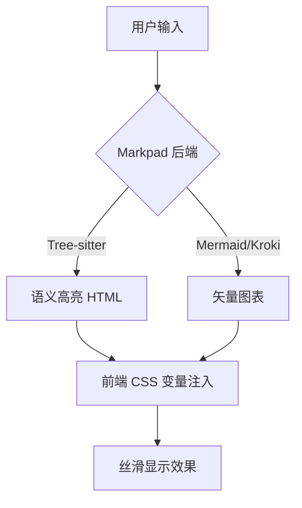
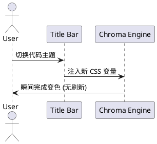
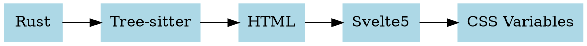

# Markpad 功能大阅兵

欢迎使用 Markpad！本文件旨在展示 **Markpad Chroma (Tree-sitter)** 高亮引擎和 **多引擎图表渲染** 的最终效果。

## 1. 绘图引擎展示

### 1.1 Mermaid (本地渲染)


### 1.2 PlantUML (Kroki)


### 1.3 GraphViz / DOT (Kroki)


### 1.4 Excalidraw (Kroki)
```excalidraw
{
  "type": "excalidraw",
  "version": 2,
  "source": "https://excalidraw.com",
  "elements": [
    { "type": "ellipse", "x": 100, "y": 100, "width": 150, "height": 80, "strokeColor": "#e03131", "backgroundColor": "#ffc9c9", "fillStyle": "hachure" },
    { "type": "text", "x": 115, "y": 125, "text": "Markpad Rocks!", "strokeColor": "#2f9e44" }
  ]
}
```

---

## 2. 静态编译高亮语言 (Markpad Chroma)

这些语言的解析器已直接编译进 Rust 二进制，提供最高性能。

### 2.1 .NET 生态 (C#)
```csharp
using System;

namespace Markpad.Demo {
    public class ChromaEngine {
        public string Name { get; set; } = "Tree-sitter";
        
        public void Render(string code) {
            Console.WriteLine($"Rendering {Name}: {code}");
        }
    }
}
```

### 2.2 系统级语言 (Rust, C++, Go)
```rust
// Rust 示例
#[derive(Debug)]
pub struct Markpad<T> {
    pub engine: T,
}

fn main() {
    let app = Markpad { engine: "Chroma" };
    println!("Hello from {:?}", app);
}
```

```cpp
// C++ 示例
#include <iostream>
#include <vector>

int main() {
    std::vector<std::string> features = {"TOC", "Theme", "Chroma"};
    for (const auto& f : features) {
        std::cout << "Feature: " << f << std::endl;
    }
    return 0;
}
```

### 2.3 前端与脚本 (TS, Python, Bash)
```typescript
interface Theme {
    name: string;
    colors: Record<string, string>;
}

const applyTheme = (t: Theme): void => {
    Object.entries(t.colors).forEach(([key, val]) => {
        document.documentElement.style.setProperty(`--ms-${key}`, val);
    });
};
```

```python
def calculate_blake3_hash(content: str) -> str:
    import blake3
    return blake3.blake3(content.encode()).hexdigest()
```

### 2.4 数据与配置 (JSON, YAML, TOML)
```toml
[markpad]
version = "2.4.0"
features = ["tree-sitter", "kroki", "lru-cache"]

[theme]
active = "vscode-dark-modern"
```

---

## 3. 动态加载语言 (测试用)

这些语言目前作为备选，用于测试解析器缺失时的降级表现。

### 3.1 Ruby
```ruby
class Markpad
  def initialize(mode)
    @mode = mode
  end

  def status
    puts "Running in #{@mode} mode"
  end
end
```

### 3.2 Swift
```swift
struct Feature {
    let name: String
    var isEnabled: Bool
}

let chroma = Feature(name: "Chroma", isEnabled: true)
print("Is \(chroma.name) on? \(chroma.isEnabled)")
```

---

## 4. 数学公式与其它

支持 KaTeX 渲染：
$$\Gamma(z) = \int_0^\infty t^{z-1}e^{-t}dt$$

甚至简单的黑白绘图 **Ditaa**：
```ditaa
+---------+       +---------+
|  Input  | ----> | Process |
+---------+       +---------+
```
