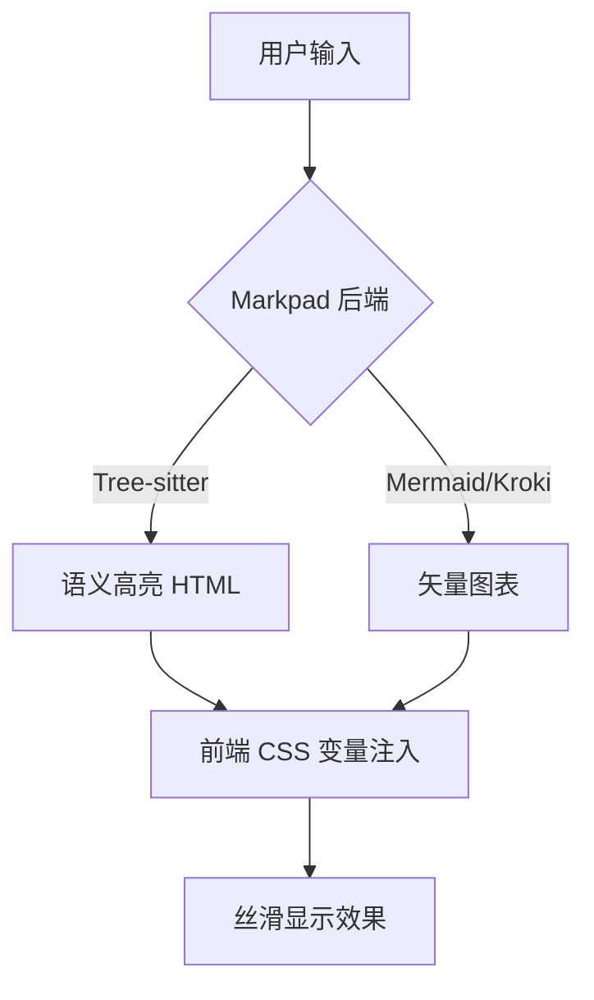
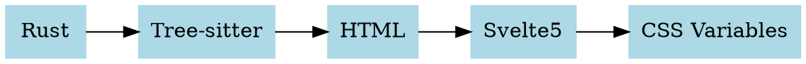
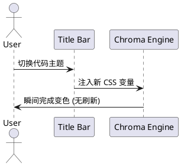

# Markpad 功能大阅兵

欢迎使用 Markpad！本文件旨在展示 **Markpad Chroma (Tree-sitter)** 高亮引擎和 **多引擎图表渲染** 的最终效果。

## 1. 绘图引擎展示

Markpad 支持多种图表渲染模式：**本地 JS/WASM 渲染**、**本地 Rust 渲染**、**Kroki 远程渲染**。

### 1.1 Mermaid (本地 JS 渲染)

```mermaid
graph TB
    A[用户输入] --> B{Markpad 后端}
    B -->|Tree-sitter| C[语义高亮 HTML]
    B -->|Mermaid/Kroki| D[矢量图表]
    C --> E[前端 CSS 变量注入]
    D --> E
    E --> F[丝滑显示效果]
```

### 1.2 GraphViz / DOT (本地 WASM 或 Rust 渲染)

```dot
digraph G {
  rankdir=LR;
  node [shape=box, style=filled, color=lightblue];
  Rust -> "Tree-sitter";
  "Tree-sitter" -> HTML;
  HTML -> Svelte5;
  Svelte5 -> "CSS Variables";
}
```

### 1.3 Nomnoml (本地 JS 渲染)
```nomnoml
[<frame>Decorator pattern|
  [<abstract>Component|
    operation()]
  [Client] depends --> [Component]
  [Decorator] decorates -- [ConcreteComponent]
  [ConcreteComponent] inherits -- [Component]
  [Decorator] inherits -- [Component]
]
```

### 1.4 Vega-Lite (本地 JS 渲染)
```vegalite
{
  "$schema": "https://vega.github.io/schema/vega-lite/v5.json",
  "description": "A simple bar chart with embedded data.",
  "data": {
    "values": [
      {"a": "A", "b": 28}, {"a": "B", "b": 55}, {"a": "C", "b": 43},
      {"a": "D", "b": 91}, {"a": "E", "b": 81}, {"a": "F", "b": 53}
    ]
  },
  "mark": "bar",
  "encoding": {
    "x": {"field": "a", "type": "nominal", "axis": {"labelAngle": 0}},
    "y": {"field": "b", "type": "quantitative"}
  }
}
```

### 1.5 BPMN (本地 JS 渲染)
```bpmn
<?xml version="1.0" encoding="UTF-8"?>
<bpmn:definitions xmlns:bpmn="http://www.omg.org/spec/BPMN/20100524/MODEL"
  xmlns:bpmndi="http://www.omg.org/spec/BPMN/20100524/DI"
  xmlns:dc="http://www.omg.org/spec/DD/20100524/DC"
  xmlns:di="http://www.omg.org/spec/DD/20100524/DI"
  id="Definitions_1" targetNamespace="http://bpmn.io/schema/bpmn">
  <bpmn:process id="Process_1" isExecutable="false">
    <bpmn:startEvent id="StartEvent_1" name="Start"/>
    <bpmn:task id="Task_1" name="Review Document"/>
    <bpmn:endEvent id="EndEvent_1" name="End"/>
    <bpmn:sequenceFlow id="Flow_1" sourceRef="StartEvent_1" targetRef="Task_1"/>
    <bpmn:sequenceFlow id="Flow_2" sourceRef="Task_1" targetRef="EndEvent_1"/>
  </bpmn:process>
  <bpmndi:BPMNDiagram id="BPMNDiagram_1">
    <bpmndi:BPMNPlane id="BPMNPlane_1" bpmnElement="Process_1">
      <bpmndi:BPMNShape id="StartEvent_1_di" bpmnElement="StartEvent_1">
        <dc:Bounds x="152" y="102" width="36" height="36"/>
        <bpmndi:BPMNLabel>
          <dc:Bounds x="159" y="145" width="22" height="14"/>
        </bpmndi:BPMNLabel>
      </bpmndi:BPMNShape>
      <bpmndi:BPMNShape id="Task_1_di" bpmnElement="Task_1">
        <dc:Bounds x="240" y="80" width="100" height="80"/>
      </bpmndi:BPMNShape>
      <bpmndi:BPMNShape id="EndEvent_1_di" bpmnElement="EndEvent_1">
        <dc:Bounds x="402" y="102" width="36" height="36"/>
        <bpmndi:BPMNLabel>
          <dc:Bounds x="410" y="145" width="20" height="14"/>
        </bpmndi:BPMNLabel>
      </bpmndi:BPMNShape>
      <bpmndi:BPMNEdge id="Flow_1_di" bpmnElement="Flow_1">
        <di:waypoint x="188" y="120"/>
        <di:waypoint x="240" y="120"/>
      </bpmndi:BPMNEdge>
      <bpmndi:BPMNEdge id="Flow_2_di" bpmnElement="Flow_2">
        <di:waypoint x="340" y="120"/>
        <di:waypoint x="402" y="120"/>
      </bpmndi:BPMNEdge>
    </bpmndi:BPMNPlane>
  </bpmndi:BPMNDiagram>
</bpmn:definitions>
```

### 1.6 Svgbob (本地 Rust 渲染)
```svgbob
+---------+       +---------+
|  Input  | ----> | Process |
+---------+       +---------+
     |                 |
     v                 v
+---------+       +---------+
| Parser  |       | Output  |
+---------+       +---------+
```

### 1.7 PlantUML (Kroki 远程渲染)

```plantuml
@startuml
actor User
participant "Title Bar" as TB
participant "Chroma Engine" as CE

User -> TB: 切换代码主题
TB -> CE: 注入新 CSS 变量
CE -> User: 瞬间完成变色 (无刷新)
@enduml
```

### 1.8 Excalidraw (本地 JS 渲染)
```excalidraw
{
  "type": "excalidraw",
  "version": 2,
  "source": "https://excalidraw.com",
  "elements": [
    { "type": "ellipse", "x": 100, "y": 100, "width": 150, "height": 80, "strokeColor": "#e03131", "backgroundColor": "#ffc9c9", "fillStyle": "hachure" },
    { "type": "text", "x": 115, "y": 125, "text": "Markpad Rocks!", "strokeColor": "#2f9e44" }
  ]
}
```

---

## 2. 静态编译高亮语言 (Markpad Chroma)

这些语言的解析器已直接编译进 Rust 二进制，提供最高性能。

### 2.1 .NET 生态 (C#)
```csharp
using System;

namespace Markpad.Demo {
    public class ChromaEngine {
        public string Name { get; set; } = "Tree-sitter";

        public void Render(string code) {
            Console.WriteLine($"Rendering {Name}: {code}");
        }
    }
}
```

### 2.2 系统级语言 (Rust, C++, Go)
```rust
// Rust 示例
#[derive(Debug)]
pub struct Markpad<T> {
    pub engine: T,
}

fn main() {
    let app = Markpad { engine: "Chroma" };
    println!("Hello from {:?}", app);
}
```

```cpp
// C++ 示例
#include <iostream>
#include <vector>

int main() {
    std::vector<std::string> features = {"TOC", "Theme", "Chroma"};
    for (const auto& f : features) {
        std::cout << "Feature: " << f << std::endl;
    }
    return 0;
}
```

### 2.3 前端与脚本 (TS, Python, Bash)
```typescript
interface Theme {
    name: string;
    colors: Record<string, string>;
}

const applyTheme = (t: Theme): void => {
    Object.entries(t.colors).forEach(([key, val]) => {
        document.documentElement.style.setProperty(`--ms-${key}`, val);
    });
};
```

```python
def calculate_blake3_hash(content: str) -> str:
    import blake3
    return blake3.blake3(content.encode()).hexdigest()
```

### 2.4 数据与配置 (JSON, YAML, TOML)
```toml
[markpad]
version = "2.4.0"
features = ["tree-sitter", "kroki", "lru-cache"]

[theme]
active = "vscode-dark-modern"
```

---

## 3. 动态加载语言 (测试用)

这些语言目前作为备选，用于测试解析器缺失时的降级表现。

### 3.1 Ruby
```ruby
class Markpad
  def initialize(mode)
    @mode = mode
  end

  def status
    puts "Running in #{@mode} mode"
  end
end
```

### 3.2 Swift
```swift
struct Feature {
    let name: String
    var isEnabled: Bool
}

let chroma = Feature(name: "Chroma", isEnabled: true)
print("Is \(chroma.name) on? \(chroma.isEnabled)")
```

---

## 4. 数学公式与其它

### 4.1 KaTeX 支持情况

项目已集成 KaTeX (v0.16.27)，通过 `katex/dist/contrib/auto-render` 实现。

**支持的格式：**

| 分隔符 | 类型 | 示例 |
|--------|------|------|
| `$$...$$` | 块级公式 | `$$E=mc^2$$` |
| `$...$` | 行内公式 | `$x^2$` |
| `\(...\)` | 行内公式 | `\(x^2\)` |
| `\[...\]` | 块级公式 | `\[E=mc^2\]` |
| ` ```math ` 代码块 | 块级公式 | 数学公式代码块 |
| ` ```latex ` 代码块 | 块级公式 | LaTeX 公式代码块 |

### 4.2 KaTeX 渲染示例

块级公式 `$$...$$`：
$$\Gamma(z) = \int_0^\infty t^{z-1}e^{-t}dt$$

行内公式 `$...$`：质能方程 $E=mc^2$ 是物理学中最著名的公式之一。

LaTeX 分隔符 `\[...\]`：
\[\sum_{i=1}^{n} i = \frac{n(n+1)}{2}\]

多行块级公式（麦克斯韦方程组）：
$$
\begin{aligned}
\nabla \cdot \mathbf{E} &= \frac{\rho}{\varepsilon_0} \\
\nabla \cdot \mathbf{B} &= 0 \\
\nabla \times \mathbf{E} &= -\frac{\partial \mathbf{B}}{\partial t} \\
\nabla \times \mathbf{B} &= \mu_0 \mathbf{J} + \mu_0 \varepsilon_0 \frac{\partial \mathbf{E}}{\partial t}
\end{aligned}
$$

矩阵公式：
$$
\mathbf{A} = \begin{pmatrix}
a_{11} & a_{12} & \cdots & a_{1n} \\
a_{21} & a_{22} & \cdots & a_{2n} \\
\vdots & \vdots & \ddots & \vdots \\
a_{m1} & a_{m2} & \cdots & a_{mn}
\end{pmatrix}
$$

### 4.3 代码块数学公式

使用 `math` 或 `latex` 代码块：

```math
\frac{-b \pm \sqrt{b^2 - 4ac}}{2a}
```

```latex
\begin{matrix}
a & b \\
c & d
\end{matrix}
```

复杂的矩阵运算：

```math
\mathbf{C} = \mathbf{A} \times \mathbf{B} = \begin{pmatrix}
\sum_{k=1}^{n} a_{1k}b_{k1} & \sum_{k=1}^{n} a_{1k}b_{k2} & \cdots \\
\sum_{k=1}^{n} a_{2k}b_{k1} & \sum_{k=1}^{n} a_{2k}b_{k2} & \cdots \\
\vdots & \vdots & \ddots
\end{pmatrix}
```

---

## 5. 其他图表

甚至简单的黑白绘图 **Ditaa**：
```ditaa
+---------+       +---------+
|  Input  | ----> | Process |
+---------+       +---------+
```
