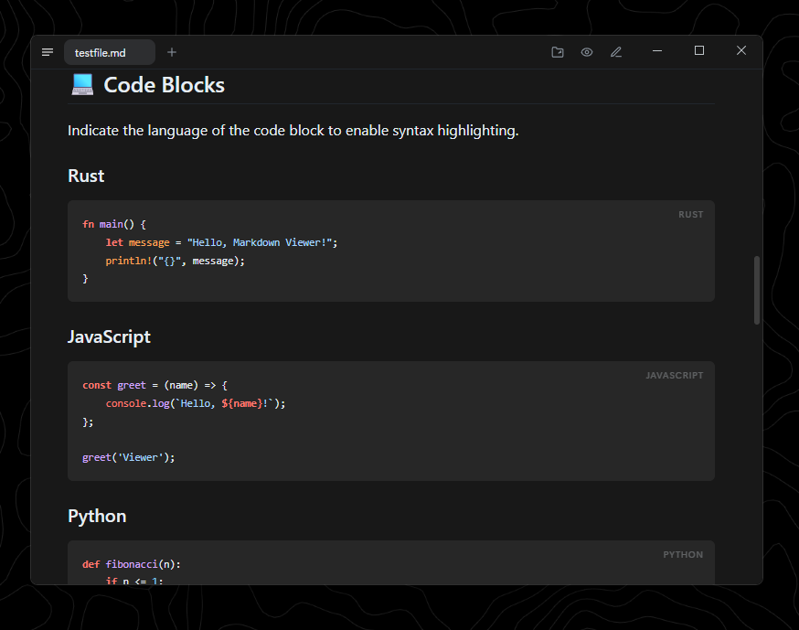

# 导出管线集成测试

本文档专用于导出管线的文件驱动集成测试（`src/lib/export.integration.test.ts`
与 `scripts/export-e2e.mjs`）。内容刻意覆盖导出变换的每个消费点：
frontmatter 面板剥离、图表 wrapper 保留、本地图片 dataURI、`.md` 链接改写、
目录锚点与交互脚本注入。

## 代码块

```javascript
const answer = 42;
console.log("answer:", answer);
```

## 图表


## 本地图片转 dataURI



## 链接改写

相对链接指向邻居文档：[基本语法参考](testfile.md)

外链保持不变：[Markpad](https://github.com/bhxch/Markpad)

## 宽表格

| 列一 | 列二 | 列三 |
|------|------|------|
| 内容甲 | 内容乙 | 内容丙 |

## 结论

导出物应包含以上全部内容，且交互脚本、目录锚点、dataURI 图片齐备。
